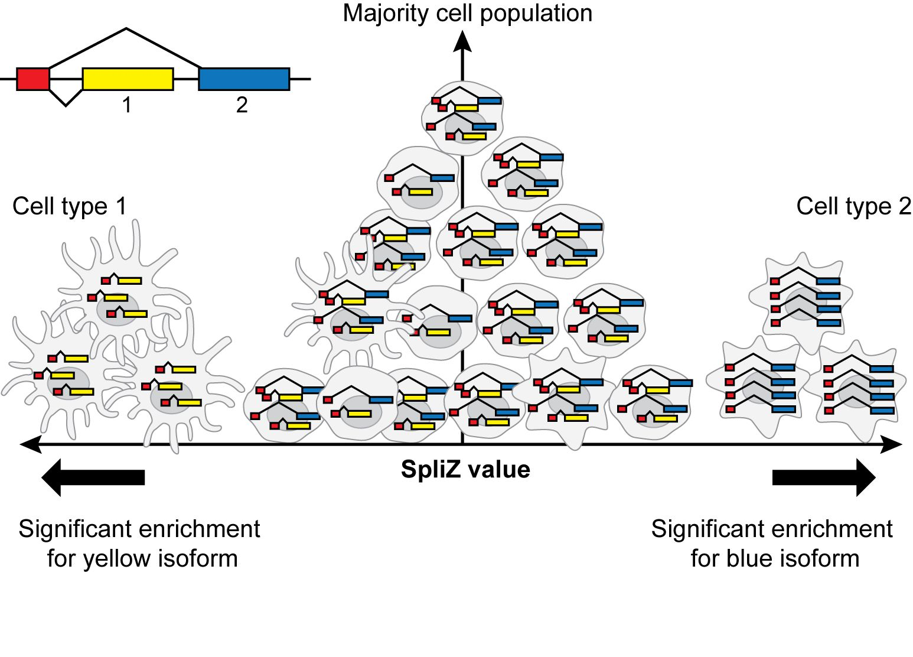

# SpliZ Pipeline



This repository contains code to perform the analyses in the paper ["The SpliZ generalizes “Percent Spliced In” to reveal regulated splicing at single-cell resolution" (Olivieri, Dehghannasiri, and Salzman 2021)](https://www.biorxiv.org/content/10.1101/2020.11.10.377572v2). 

This pipeline takes the output from [SICILIAN](https://github.com/salzmanlab/SICILIAN) and returns the SpliZ for each gene and cell, as well as analyses of differential alternative splicing.


## Installation and setup

Clone this repository:
`$ git clone https://github.com/juliaolivieri/SpliZ_pipeline.git`

`$ cd SpliZ_pipeline/`

Ensure that conda is working on your system. <!-- If you are working on sherlock on the horence partition, you can try adding `export PATH="/share/PI/horence/applications/anaconda3/bin/:$PATH"` to your .bashrc. -->
Then set up the conda environment from the environment.yml file:

`$ conda env create --name spliz_env --file=environment.yml`

and activate it:

`$ source activate spliz_env`

If this activation step doesn't work, try running `conda env list` and looking for the path that ends with `spliz_env`. Then run `source activate <full path>`. <!-- for example `source activate /share/PI/horence/applications/anaconda3/envs/spliz_env`. -->

This whole process should take less than 5 minutes on a normal computer.

## Running the pipeline on test data

Use the following command to run the pipeline on the small test dataset (labeled `test` in the `data` folder):

`snakemake -p --config datasets="test" --restart-times 0`

This should take less than 5 minutes to run on a local computer with at least 3 Gb free space.

You can check the output file `scripts/output/variance_adjusted_permutations/test_pvals_compartment-tissue_100_S_0.1_z_0.0_b_5.tsv` against the sample output file `test_pvals_compartment-tissue_100_S_0.1_z_0.0_b_5.tsv` in the main directory.

## Downloading data from paper

You will need to place the following files in the "data" directory, accessible on [figshare](https://figshare.com/articles/dataset/Tables_and_Data_for_SpliZ_Manuscript/14378819):
* `HLCA4_P2_10x_with_postprocessing_lung.pq`
* `HLCA4_P3_10x_with_postprocessing_lung.pq`

<!--
And the following file in the util_files directory:
* `GRCh38_latest_genomic.gtf`

If you are working on Sherlock with access to the horence partition, you can run 

`cp /oak/stanford/groups/horence/JuliaO/SZS_data/* data/`

and

`cp /oak/stanford/groups/horence/JuliaO/gtf_files/GRCh38_latest_genomic.gtf util_files/`

to get these files.
-->

## Running the pipeline

Then run `snakemake -p` in the main directory (I run `snakemake -p --profile slurm` to run on sherlock). You can run `snakemake -np` first to see what jobs will be run. Each job automatically re-submits itself two times if it fails, so if you want to run without these resubmissions (for debugging purposes) you can run `snakemake -p --profile slurm --restart-times 0`.

The terminal window you submit from will not be available again until after the full pipeline runs. You can use tmux to subset your termianl pane so that snakemake is only running in one box (this also allows you to detatch the session so it continues running even when terminal isn't open). For the tmux approach you will have to always log in to the same node on sherlock so you can reconnect to the same session (for example, `ssh jolivier@sh02-ln04.stanford.edu`). 

The pipeline should take around one hour to run.

To set up snakemake to run on slurm, you can follow the directions here: [https://github.com/Snakemake-Profiles/slurm](https://github.com/Snakemake-Profiles/slurm). If you are working on sherlock using the horence partition, you can try copying the folder `/oak/stanford/groups/horence/JuliaO/snakemake/` to `~/.config` by running `cp -r /oak/stanford/groups/horence/JuliaO/snakemake ~/.config/` instead. You can then edit `~/.config/snakemake/slurm/slurm-submit.py` to change the `SBATCH_DEFAULTS` variable if you want (the current defaults are to use the partitions owners and horence, 10 minutes of time, and 4Gb of memory). All of the time and memory requirements for the SZS pipeline are specified in the script itself, so you don't need to change these variables if you're only running this pipeline.

## Output

The output file will be `scripts/output/rijk_zscore/<dataname>_sym_SVD_normgene_S_0.1_z_0.0_b_5.tsv`. The column `cell` indicates the cell, `geneR1A_uniq` is the gene name, `scZ` is the original SZS, and `svd_z0`, `svd_z1`, and `svd_z2` are the three z scores based on the first three SVD components. Note that this file has multiple lines for each gene + cell, so if you are just interested in the SZS you can deduplicate by cell + gene.

There is also output in `scripts/output/perm_pvals/*_fdr_10_0.1_z_0.0_b_5.tsv` including a p value calculated based on permutations (`quant_pval`) for each gene and ontology based on the `scZ`.

## Input file format
This pipeline works with the "class input file" output of the [SICILIAN pipeline](https://github.com/salzmanlab/SICILIAN). To run the pipeline without running SICILIAN first, your data must be in the following format: one row per gene per splice junction, with a column indicating the cell, the donor position of the splice junction, the acceptor position of the splice junction, and the number of reads mapping to that splice junction. For differential alternative splicing analysis, the file must also include the metadata for different cell groups (cell type, tissue, compartment, etc).

## Software dependencies

These are also found in the `environment.yaml` file.

```
        - python=3.6.7
        - pandas=1.0.4
        - tqdm=4.46.0
        - numpy=1.18.4
        - snakemake-minimal=5.4.5=py_0
        - pyarrow=0.15.1
        - scipy=1.4.1
        - statsmodels=0.11.1
```

## References
Olivieri, Dehghannasiri, and Salzman. "The SpliZ generalizes “Percent Spliced In” to reveal regulated splicing at single-cell resolution." bioRxiv. (2020) [https://www.biorxiv.org/content/10.1101/2020.11.10.377572v2](https://www.biorxiv.org/content/10.1101/2020.11.10.377572v2).

Dehghannasiri, Olivieri, and Salzman. "Specific splice junction detection in single cells with SICILIAN," bioRxiv. (2020) [https://www.biorxiv.org/content/10.1101/2020.04.14.041905v1](https://www.biorxiv.org/content/10.1101/2020.04.14.041905v1).
